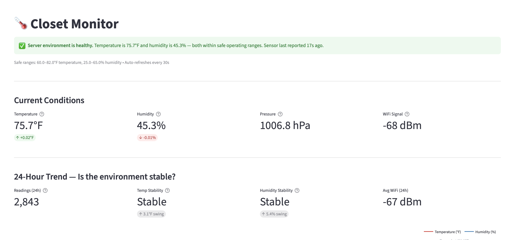
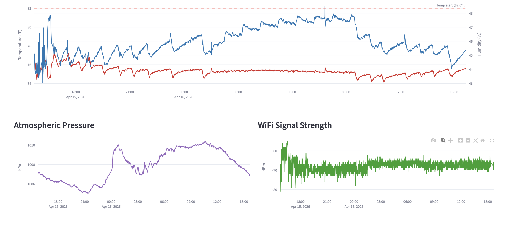
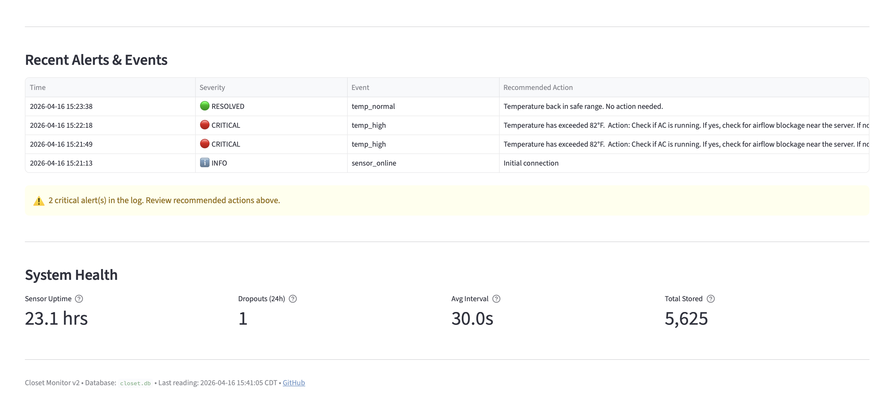

# Closet Monitor

An end-to-end IoT data pipeline for monitoring my home lab network closet — and the first node in a broader smart-home observability platform built around Home Assistant.



*The dashboard leads with the answer: "Should I worry?" Green means all conditions are within safe operating ranges. Current readings, stability assessment, and safe-range thresholds are visible at a glance.*



*24-hour interactive charts for temperature, humidity, pressure, and WiFi signal. The red dashed line marks the 82°F alert threshold — visible context for how close current conditions are to triggering an alert.*



*Incident log with color-coded severity badges and recommended actions for each event. System health metrics at the bottom answer "can I trust this data?" — sensor uptime, dropout count, average interval, total readings stored.*

## The story behind this project

This project started as a single-evening exercise: wire up a microcontroller to a temperature sensor and prove I could do basic embedded work. By the time I had the firmware working and overnight data flowing, I realized the *interesting* problem wasn't the sensor — it was what to do with the telemetry it produced.

So I pivoted.

What was a one-night embedded project became a multi-stage pipeline spanning **embedded systems → networking → backend services → data persistence → exploratory analysis → dashboarding → alerting**. Every layer is a deliberate learning surface. The goal isn't just to monitor my closet — it's to walk a complete data lifecycle with one cohesive dataset I actually understand and care about, then use it as the proving ground for a larger smart-home platform.

The closet is real. My home server lives there, running a production MCP (Model Context Protocol) server and a Meta Engagement automation pipeline. A laptop running 24/7 in an enclosed space deserves observability, and now it has it.

## What this project answers

Every dashboard, alert, and analysis in this project exists to answer a specific question — the same way production monitoring serves stakeholders in a corporate environment.

| Question | Who asks it | How it's answered |
|---|---|---|
| "Is my server environment safe right now?" | Server operator | Dashboard: green/red status banner with plain-English assessment |
| "Has anything happened that requires attention?" | Server operator | Alert listener: macOS notifications with action runbooks + incident log |
| "How efficiently is my HVAC cycling?" | Homeowner | Analysis: cycle frequency, duration, time-of-day patterns |
| "Is the environment stable or volatile?" | Both | Dashboard: stability labels (Stable/Moderate/Volatile) based on 24h swing |
| "What external factors affect my server environment?" | Analyst | Analysis: door events, human presence, time-of-day correlation |
| "Can I trust this monitoring data?" | System operator | Dashboard: sensor uptime, dropout count, average interval |

## Where this is headed

This repo is the foundation for a larger **smart home + home lab observability platform**:

- **Home Assistant on a Raspberry Pi 5** as the central hub, ingesting data from this sensor and other smart devices
- **Ecobee thermostat integration** via Home Assistant, with cross-correlation analysis between the wall thermostat readings and what's actually happening in the closet
- **Three wall-mounted 10-inch tablets** as monitoring and control panels around the house, running Home Assistant's Lovelace UI
- **Multiple sensor projects** feeding into the same data fabric over time

The closet monitor proves out the pipeline pattern. Future sensor projects (door reed switches, motion sensors, current monitors) will reuse this MQTT → broker → database → dashboard architecture.

## Architecture (current)

```
┌─────────────────┐
│  ESP32 + BME280 │  Edge device — embedded C++
└────────┬────────┘
         │ WiFi · MQTT
         ▼
┌─────────────────┐
│ Mosquitto Broker│  Message broker
└────────┬────────┘
         │ subscribe
         ▼
┌──────────────────┐    ┌──────────────────┐
│ Python Subscriber│    │  Alert Listener  │
│ paho-mqtt→SQLite │    │ notifications +  │
│                  │    │ runbook actions   │
└────────┬─────────┘    └──────────────────┘
         │
         ▼
┌──────────────────┐
│  SQLite Database │  readings + events + alerts
└────────┬─────────┘
         │
   ┌─────┴─────┬──────────────┐
   ▼           ▼              ▼
Jupyter    Streamlit      MCP tool
analysis   dashboard      (planned)
```

## Architecture (target)

```
┌─────────────────┐    ┌─────────────────┐
│  ESP32 + BME280 │    │ Ecobee Thermostat│
│ (closet sensor) │    │  (whole house)   │
└────────┬────────┘    └────────┬─────────┘
         │ MQTT                  │ Cloud API
         ▼                       ▼
┌─────────────────────────────────────────┐
│  Home Assistant on Raspberry Pi 5       │
│  + Mosquitto broker (production)        │
│  + SQLite/Postgres for long-term data   │
└────────┬────────────────────────────────┘
         │
   ┌─────┴──────┬──────────────┬──────────────┐
   ▼            ▼              ▼              ▼
Tablet UIs   Lovelace      Cross-source   AI insights
(3 around    dashboards    analytics      (anomaly
 the house)                (HA + closet)  detection)
```

## Hardware

- **ESP32-WROOM-32** (Teyleten 38-pin, USB-C) — dual-core 240 MHz microcontroller with WiFi + Bluetooth
- **BME280 sensor** (SHILLEHTEK pre-soldered, 3.3V, I²C at 0x76) — temperature, humidity, pressure
- **4 female-to-female Dupont jumper wires** — direct ESP32-to-sensor connection (no breadboard)
- **3D-printable enclosure** — two-piece design (ESP32 cradle + remote sensor pod), STL files in `case-design/`

### Wiring

| BME280 Pin | ESP32 Pin |
|---|---|
| VCC | 3V3 |
| GND | GND |
| SCL | GPIO 22 |
| SDA | GPIO 21 |

## Software stack

- **Firmware:** Arduino C++ using PubSubClient (MQTT) and Adafruit BME280 libraries
- **Broker:** Eclipse Mosquitto 2.x
- **Subscriber:** Python 3 with paho-mqtt and python-dotenv
- **Alert Listener:** Python 3 with macOS native notifications, action runbooks, SQLite logging
- **Database:** SQLite 3 (readings, events, and alerts tables)
- **Analysis:** Python with pandas, matplotlib, seaborn, scipy (Jupyter notebooks)
- **Dashboard:** Streamlit + Plotly, framed around stakeholder questions
- **Toolchain:** `arduino-cli` for firmware, virtualenv for Python dependencies

## MQTT topics

| Topic | Payload | Frequency |
|---|---|---|
| `home/closet/status` | `online` / `offline` (retained, LWT) | On connect/disconnect |
| `home/closet/environment` | JSON (temp, humidity, pressure, RSSI, uptime) | Every 30s |
| `home/closet/alerts/temperature` | JSON alert state (retained, edge-triggered) | On threshold cross |
| `home/closet/alerts/humidity` | JSON alert state (retained, edge-triggered) | On threshold cross |

The `home/` prefix and standard payload format are intentionally Home Assistant-friendly. When the platform comes online, HA will subscribe to these topics with no firmware changes required.

### Example payload

```json
{
  "temp_f": 76.71,
  "temp_c": 24.84,
  "humidity": 41.44,
  "pressure_hpa": 1009.71,
  "rssi": -72,
  "uptime_s": 60
}
```

## Database schema

```sql
CREATE TABLE readings (
    id              INTEGER PRIMARY KEY AUTOINCREMENT,
    received_at     TEXT NOT NULL,
    device_uptime_s INTEGER,
    temp_f          REAL,
    temp_c          REAL,
    humidity        REAL,
    pressure_hpa    REAL,
    rssi            INTEGER
);

CREATE TABLE events (
    id          INTEGER PRIMARY KEY AUTOINCREMENT,
    received_at TEXT NOT NULL,
    topic       TEXT NOT NULL,
    payload     TEXT NOT NULL
);

CREATE TABLE alerts (
    id          INTEGER PRIMARY KEY AUTOINCREMENT,
    received_at TEXT NOT NULL,
    severity    TEXT NOT NULL,
    event_type  TEXT NOT NULL,
    topic       TEXT NOT NULL,
    payload     TEXT NOT NULL,
    action      TEXT
);
```

## Findings so far

After ~48 hours of continuous operation and 5,600+ readings:

- **Zero packet loss** over the full run (intervals ranged 27.5–32.5s, target 30s)
- Temperature held within a tight 5.4°F band with std dev of just 0.91°F — evidence of healthy HVAC behavior
- **15 HVAC cycles automatically detected** using rolling-mean smoothing + scipy peak detection
- Cycle lengths split into two distinct regimes: **short cycles (16–50 min) during evening peak hours**, **long cycles (100+ min) overnight** — consistent with healthy outside-temperature-driven HVAC behavior
- Average temperature swing per cycle: 1.29°F (tight thermostat control)
- **Rate-of-change anomaly detection** identified 31 rapid temperature events and 67 rapid humidity events using a rolling z-score method
- Detected a **door-closing event at approximately 1:40 AM** from its thermal signature: sudden temperature rise (+1.68°F over 3 minutes) with simultaneous humidity drop, consistent with sealing a warmer, drier room
- Multiple brief humidity spike events (z>10) correlated with human presence and activity in the bedroom

## Alert system

Every alert includes three things: **what happened, why it matters, and what to do about it.**

| Alert | Severity | Action |
|---|---|---|
| Temp > 82°F | CRITICAL | Check if AC is running. If yes, investigate airflow blockage. If no, check thermostat. |
| Temp < 60°F | WARNING | Check if heating is running. Possible HVAC failure. |
| Humidity > 65% | CRITICAL | Check for water intrusion or AC drain issue. Inspect equipment for condensation. |
| Humidity < 25% | WARNING | Consider humidifier. Avoid touching components without grounding. |
| Sensor offline > 5 min | WARNING | Check USB power to ESP32. Check WiFi. Press EN button to reset. |

Alerts are delivered via macOS desktop notifications and logged to both a flat file (`alerts.log`) and the SQLite `alerts` table for dashboard display and historical analysis.

## Setup

### Firmware

1. Copy `config.example.h` to `config.h` and fill in WiFi credentials and MQTT broker IP
2. Install toolchain:
   ```bash
   brew install arduino-cli mosquitto
   arduino-cli core install esp32:esp32
   arduino-cli lib install "PubSubClient" "Adafruit BME280 Library" "Adafruit Unified Sensor"
   ```
3. Compile and upload (hold BOOT button on ESP32 during upload):
   ```bash
   arduino-cli compile --fqbn esp32:esp32:esp32 .
   arduino-cli upload -p /dev/cu.usbserial-0001 --fqbn esp32:esp32:esp32 .
   ```

### Subscriber + Alert Listener

```bash
cd subscriber
python3 -m venv venv
source venv/bin/activate
pip install -r requirements.txt
cp .env.example .env       # edit with your broker IP

# Terminal 1: data subscriber
python subscriber.py

# Terminal 2: alert listener
python alert_listener.py
```

### Dashboard

```bash
cd subscriber && source venv/bin/activate
cd ../dashboard
streamlit run dashboard.py
# Opens at http://localhost:8501
```

### Analysis

```bash
cd analysis
jupyter lab
```

### Verify the pipeline

```bash
mosquitto_sub -h <broker-ip> -t "home/closet/#" -v
sqlite3 data/closet.db "SELECT COUNT(*) FROM readings;"
```

## Design decisions

- **JSON payloads** over binary — slightly more bandwidth, massively easier to debug with `mosquitto_sub -v` and to consume from any language. Also Home Assistant-friendly out of the box.
- **Edge-triggered alerts** — alert topics only publish when state changes, avoiding alert spam while still capturing every transition. Retained flag ensures late subscribers see current state.
- **Last Will & Testament** — broker auto-publishes `offline` to `home/closet/status` if the ESP32 disconnects uncleanly.
- **Non-blocking main loop** — uses `millis()` timing instead of `delay()` so the MQTT client can service keepalives and reconnections between sensor reads.
- **Separation of concerns** — credentials live in `config.h` (firmware) and `.env` (subscriber), both gitignored. Example templates are committed.
- **Server-side timestamps** — the subscriber records `received_at` independently of the device's `uptime_s`, so reading order is preserved even if the device reboots.
- **Runbook-based alerting** — every alert includes a recommended action, not just a notification. This mirrors how production incident management systems (PagerDuty, OpsGenie) operate.
- **Dashboard framed around questions, not metrics** — each section answers a specific stakeholder question ("Should I worry?", "What's the trend?", "Has anything happened?", "Can I trust this data?"). This is how business intelligence dashboards are designed in corporate environments.
- **SQLite over Postgres for the first iteration** — single-file database, zero ops overhead, sufficient throughput for 30s sampling. Migration to Postgres or DuckDB happens when data volumes or query patterns demand it.
- **MQTT topic naming follows the Home Assistant convention** — `home/<location>/<metric>` — so the eventual HA migration is configuration-only, no firmware changes.

## Repository layout

```
closet-monitor/
├── closet-monitor.ino                 # ESP32 firmware
├── config.example.h                   # Firmware config template
├── case-design/
│   ├── esp32_case.scad                # OpenSCAD source (ESP32 enclosure)
│   ├── esp32_case.stl                 # Print-ready STL
│   ├── sensor_pod.scad                # OpenSCAD source (BME280 pod)
│   ├── sensor_pod.stl                 # Print-ready STL
│   └── PRINT_SPEC.md                 # Print settings and service recommendations
├── data/
│   ├── sample-overnight-*.log         # Sample dataset
│   └── closet.db                      # Live SQLite database (gitignored)
├── subscriber/
│   ├── subscriber.py                  # MQTT → SQLite service
│   ├── alert_listener.py             # Alert notifications + runbook actions
│   ├── requirements.txt               # Python dependencies
│   └── .env.example                   # Config template
├── analysis/
│   └── 01-exploratory-analysis.ipynb  # Jupyter notebook
├── dashboard/
│   └── dashboard.py                   # Streamlit operations dashboard
├── docs/
│   └── screenshots/                   # README assets
└── README.md
```

## Roadmap

### Done
- [x] ESP32 firmware with WiFi + MQTT + BME280
- [x] Threshold-based alerting (edge-triggered)
- [x] Python subscriber with SQLite persistence
- [x] Sample overnight dataset (~955 readings, 8 hours continuous)
- [x] Exploratory analysis: descriptive stats, time-series plots, correlation
- [x] HVAC cycle detection with scipy peak detection
- [x] Cycle length analysis and time-of-day pattern identification
- [x] Rate-of-change anomaly detection with rolling z-score
- [x] Detected real-world events from sensor signatures (door closing, human presence)
- [x] Streamlit dashboard framed around stakeholder questions
- [x] Alert listener with macOS notifications and action runbooks
- [x] 3D-printable case design (ESP32 enclosure + sensor pod)

### Next
- [ ] Ecobee integration via Home Assistant HomeKit Controller
- [ ] Cross-correlation analysis: closet temp vs. thermostat schedule
- [ ] AI-generated daily summary reports
- [ ] Migrate broker + services to production server (Acer)

### Platform
- [ ] Install Home Assistant on Raspberry Pi 5
- [ ] Connect HA to existing MQTT topics (zero firmware changes)
- [ ] Add ecobee integration through HA
- [ ] Build Lovelace dashboard combining closet sensor + ecobee data
- [ ] Deploy 3 wall-mounted tablets running HA's tablet UI
- [ ] MCP integration so Claude can query the unified data through HA

### Future sensors
- [ ] PIR motion sensor in the closet
- [ ] Door reed switch on the closet door
- [ ] Current sensor on the home server's power cable
- [ ] Additional environmental nodes in other parts of the house

## Why this lives in one repo

The temptation with a project like this is to split it into multiple repos — one for firmware, one for the subscriber service, one for analysis. I'm deliberately keeping them together because the *story* of this project is the integration. Anyone reading this repo can follow a single physical signal — temperature in a closet — through every stage of an end-to-end data system. That narrative is more valuable to me right now than the modularity. When a piece outgrows this layout (likely the Home Assistant integration), it'll move to its own repo with proper boundaries.

Related Infrastructure
This sensor is one node in a broader home lab network documented at git-init-home-lab.
The ESP32 currently connects via the Gorgeous SSID (VLAN 20, TRUSTED) and publishes MQTT to a Mosquitto broker on the MacBook Pro. When Mosquitto migrates to the Raspberry Pi 4B (192.168.10.16, VLAN 10, SERVER), the ESP32 will move to the Gorgeous-Auto SSID (VLAN 31, IOT-AUTO) — a dedicated automation VLAN that permits only MQTT and DNS traffic to the Pi via Cisco ACLs.

## Author

Julius Moore — part of a broader home lab build, developed alongside coursework for B.S. Software Engineering at WGU.
